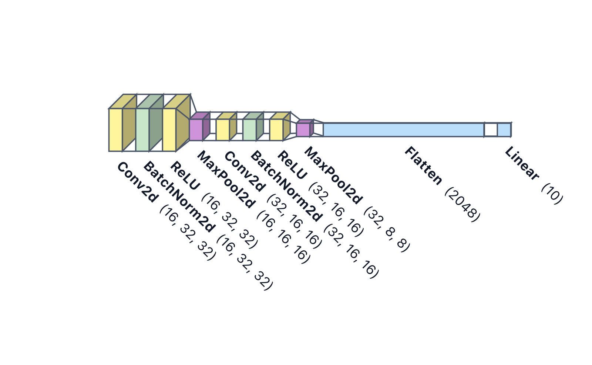

# ONNX

```python
import modelvision as mv

mv.render("model.onnx", output="model.svg")
```



The ONNX inspector uses `onnx.load` plus
`onnx.shape_inference.infer_shapes` — neither executes the model. ONNX
op names are remapped to canonical layer types (`Conv` → `Conv2d`,
`Gemm` → `Linear`, etc.) so themes and palettes work the same way as
for framework-native inputs.

Because ONNX is a universal export format, this is the recommended
path for models you can't inspect natively (custom frameworks,
partially compiled models, remote model registries).
