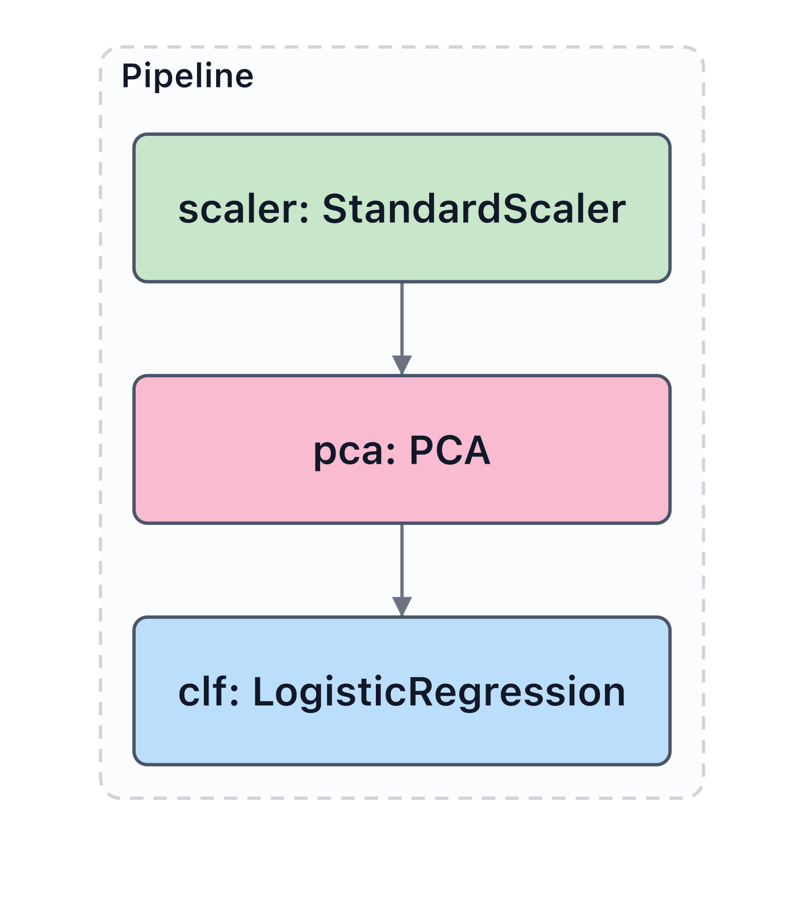

# scikit-learn

```python
from sklearn.pipeline import Pipeline
from sklearn.preprocessing import StandardScaler
from sklearn.decomposition import PCA
from sklearn.linear_model import LogisticRegression
import modelvision as mv

pipe = Pipeline([
    ("scaler", StandardScaler()),
    ("pca", PCA(2)),
    ("clf", LogisticRegression()),
])
mv.render(pipe, output="pipeline.svg")
```



`Pipeline`, `FeatureUnion`, `ColumnTransformer`, and
`GridSearchCV.best_estimator_` are all walked recursively — nested
composites become nested segment groups automatically.
