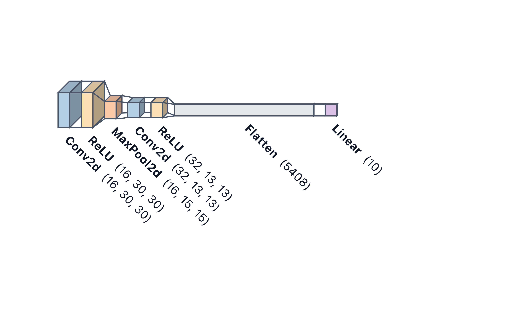
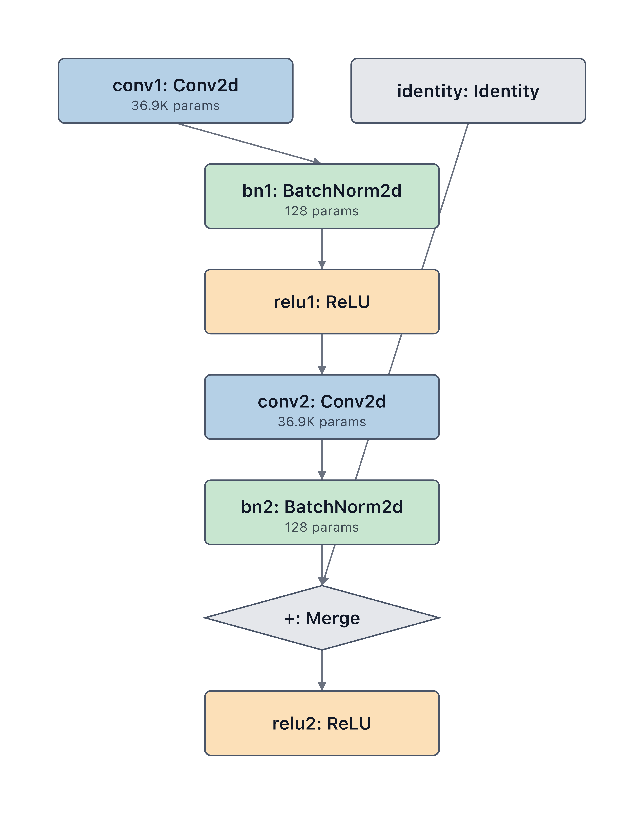

# PyTorch

## Basic model

```python
import torch.nn as nn
import modelvision as mv

model = nn.Sequential(
    nn.Conv2d(3, 16, 3), nn.ReLU(), nn.MaxPool2d(2),
    nn.Conv2d(16, 32, 3), nn.ReLU(),
    nn.Flatten(), nn.Linear(32 * 14 * 14, 10),
)
mv.render(model, "model.svg", theme="light", palette="pastel",
          layout="flow", input_shape=(1, 3, 32, 32))
```




## Cross-scope edges (opt-in)

By default the PyTorch inspector emits sequential edges within each
parent container. Residual / skip connections — where a tensor bypasses
one or more layers and merges back in later — are invisible in that mode
because the identity branch is not a named submodule in the default walk.

Pass `symbolic_shapes=True` to run `torch.fx.symbolic_trace` instead.
ModelVision then reads the real data-flow edges from the FX graph,
automatically inserts a `+: Merge` diamond wherever a node has fan-in
from more than one path, and draws the skip arc as a grey line:

```python
import torch.nn as nn
import modelvision as mv

class ResBlock(nn.Module):
    def __init__(self):
        super().__init__()
        self.conv1    = nn.Conv2d(64, 64, 3, padding=1)
        self.bn1      = nn.BatchNorm2d(64)
        self.relu1    = nn.ReLU()
        self.conv2    = nn.Conv2d(64, 64, 3, padding=1)
        self.bn2      = nn.BatchNorm2d(64)
        self.identity = nn.Identity()   # named skip path so FX sees it
        self.relu2    = nn.ReLU()

    def forward(self, x):
        h = self.relu1(self.bn1(self.conv1(x)))
        h = self.bn2(self.conv2(h))
        return self.relu2(self.identity(x) + h)

mv.render(ResBlock(), "resblock.svg",
          theme="light", palette="pastel", symbolic_shapes=True)
```



If tracing fails (dynamic control flow, unsupported ops), ModelVision
falls back to sequential edges with a warning — never an error.

## Block styles

Three `style_variant` values change how every node is drawn. They work
alongside any `layout` and any framework:

```python
# Default — 2D rounded rectangles
mv.render(model, "flat.svg",       layout="vertical")

# 3D isometric cuboids
mv.render(model, "volumetric.svg", layout="vertical", style_variant="volumetric")

# Channel-slice slabs (visualtorch stacked look)
mv.render(model, "stacked.svg",    layout="vertical", style_variant="stacked")

# Visualtorch ribbon (layout="flow" has its own isometric style built in)
mv.render(model, "flow.svg",       layout="flow",     input_shape=(1, 3, 32, 32))
```

See the [Styling guide](../styling.md#block-styles) for rendered examples of each variant.

## Weight tying

Weight-tied modules (`self.a = shared; self.b = shared`) are detected
automatically. Each site is rendered as its own node, connected by a
dashed "shared" edge. Suppress with `show_shared_weights=False`.

## Wrappers

`DataParallel`, `DistributedDataParallel`, and `torch.compile` wrappers
are unwrapped automatically before inspection — you don't need to
call `.module` or `._orig_mod` yourself.
