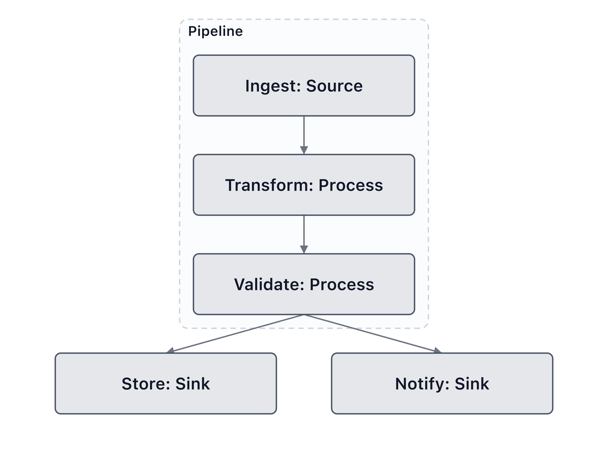

# Custom Graphs

ModelVision is not limited to ML models. You can build a diagram of any
system — data pipelines, microservices, CI/CD flows, decision trees — by
constructing a `ModelGraph` directly and passing it straight to `mv.render()`.

No framework install required. The core package is enough.

## Quick example

```python
import modelvision as mv
from modelvision import ModelGraph, LayerNode, Edge, SegmentGroup

graph = ModelGraph(
    nodes=[
        LayerNode(id="ingest",    name="Ingest",    layer_type="Source",  framework="custom"),
        LayerNode(id="transform", name="Transform", layer_type="Process", framework="custom"),
        LayerNode(id="validate",  name="Validate",  layer_type="Process", framework="custom"),
        LayerNode(id="store",     name="Store",     layer_type="Sink",    framework="custom"),
        LayerNode(id="notify",    name="Notify",    layer_type="Sink",    framework="custom"),
    ],
    edges=[
        Edge(source_id="ingest",    target_id="transform"),
        Edge(source_id="transform", target_id="validate"),
        Edge(source_id="validate",  target_id="store"),
        Edge(source_id="validate",  target_id="notify"),
    ],
    groups=[
        SegmentGroup(id="pipeline", name="Pipeline",
                     node_ids=["ingest", "transform", "validate"]),
    ],
)

mv.render(graph, "pipeline.svg", theme="light", palette="pastel", layout="vertical")
```



## Node fields

`LayerNode` is a dataclass. The three required fields are `id`, `name`,
and `layer_type` — everything else is optional.

| Field | Type | Description |
|---|---|---|
| `id` | `str` | Unique identifier — used as the edge endpoint key |
| `name` | `str` | Label shown inside the block |
| `layer_type` | `str` | Used for palette colour lookup — any string you choose |
| `framework` | `str` | Set to `"custom"` for non-ML graphs |
| `params` | `int \| None` | Optional param count shown as a sub-label |
| `output_shape` | `tuple \| None` | Optional shape annotation |
| `style_override` | `StyleSpec \| None` | Per-node colour / stroke / glow override |

## Edge fields

| Field | Type | Description |
|---|---|---|
| `source_id` | `str` | `id` of the source node |
| `target_id` | `str` | `id` of the target node |
| `label` | `str \| None` | Optional edge label |
| `kind` | `str` | `"data"` (solid arrow), `"shared"` (dashed), or `"skip"` (dashed arc) |

## Colouring nodes by type

The `layer_palette` and `palette` arguments work exactly as they do for
ML models. `layer_type` is the key — so if you name your types
consistently, colours are assigned automatically:

```python
mv.render(graph, "pipeline.svg",
    theme="light",
    layer_palette={
        "Source":  "#a8d8ea",
        "Process": "#ffd3b6",
        "Sink":    "#d4edda",
    },
    layout="vertical",
)
```

## Grouping nodes

`SegmentGroup` draws a labelled dashed container around a set of nodes.
Groups can represent subsystems, teams, or deployment boundaries:

```python
from modelvision import SegmentGroup

graph = ModelGraph(
    nodes=[...],
    edges=[...],
    groups=[
        SegmentGroup(id="ingest_zone",   name="Ingestion",  node_ids=["kafka", "parser"]),
        SegmentGroup(id="storage_zone",  name="Storage",    node_ids=["postgres", "redis"]),
    ],
)
```

## Style variants and layouts

All [style variants](styling.md#block-styles) and
[layouts](styling.md#layouts) work with custom graphs:

```python
# 3D isometric blocks
mv.render(graph, "pipeline_3d.svg", style_variant="volumetric", layout="vertical")

# Left-to-right flow
mv.render(graph, "pipeline_h.svg", layout="horizontal")
```

## Per-node styling

Use `NodeStyle` or `StyleSpec` to highlight specific nodes:

```python
from modelvision import NodeStyle
from modelvision.core.style import StyleSpec

# Via node_styles kwarg
mv.render(graph, "pipeline.svg",
    node_styles={
        "validate": NodeStyle(fill="#ffeeba", stroke="#856404", glow=True),
    },
)

# Or inline on the node itself at construction time
LayerNode(
    id="error",
    name="Error handler",
    layer_type="Handler",
    framework="custom",
    style_override=StyleSpec(fill="#f8d7da", stroke="#721c24", shape="diamond"),
)
```

## Exporting to JSON

`ModelGraph` is fully serialisable — useful for storing diagrams, diffing
them in CI, or feeding them to another tool:

```python
import json

with open("pipeline.json", "w") as f:
    json.dump(graph.to_dict(), f, indent=2)
```
