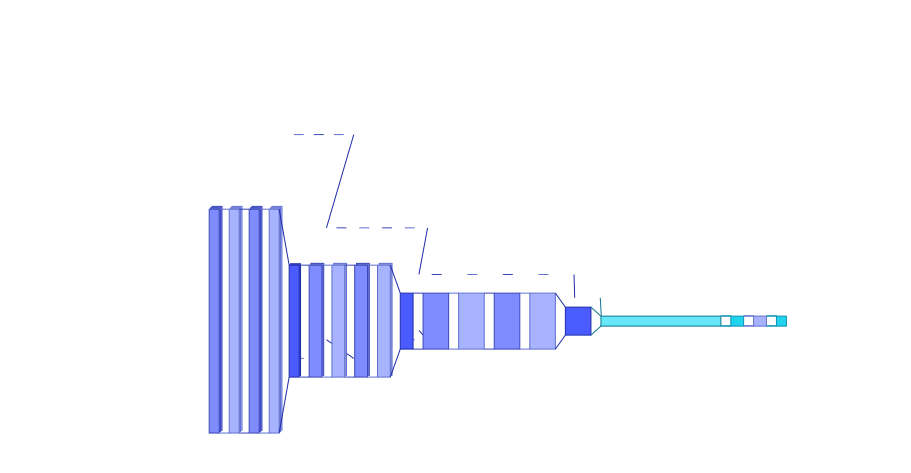

---
hide:
  - navigation
  - toc
---

<div class="hero" markdown>
<div class="hero__content" markdown>

# ModelVision

<p class="hero__tagline">
Framework-agnostic neural network architecture visualization.
Turn any PyTorch, Keras, JAX, Hugging Face, scikit-learn, or ONNX model into
a publication-ready diagram — no forward pass required.
</p>

<div class="hero__ctas" markdown>
[Get started :material-arrow-right:](getting-started.md){ .md-button .md-button--primary }
[Try the CLI](cli.md){ .md-button }
[View on GitHub :fontawesome-brands-github:](https://github.com/pianistprogrammer/ModelVision){ .md-button }
</div>

</div>
<div class="hero__preview">
  
</div>
</div>

## Why ModelVision

<div class="feature-grid" markdown>

<div class="feature-card" markdown>
### :material-source-branch: Every framework
One rendering API for PyTorch, Keras/TensorFlow, JAX/Flax, Hugging Face Transformers, scikit-learn, ONNX, and GGUF. No re-learning per framework.
</div>

<div class="feature-card" markdown>
### :material-rocket-launch: No forward pass
Static inspection means you visualize models under active development, models with dynamic control flow, or partial models before inputs exist.
</div>

<div class="feature-card" markdown>
### :material-palette: Publication-ready
Vector SVG and PDF for papers, PNG at 300 DPI for slides, interactive HTML for exploration. Six built-in themes plus full style control.
</div>

<div class="feature-card" markdown>
### :material-console: LLM-friendly CLI
Every render option is a flag. `--json` output, `--dry-run` for cheap previews, stable exit codes. Purpose-built for agent tool-calling.
</div>

<div class="feature-card" markdown>
### :material-image-multiple: Visualtorch-inspired
3D isometric extruded blocks, tapered flow ribbons, stacked-slice channels — the aesthetic space of visualtorch, in a modern framework-agnostic package.
</div>

<div class="feature-card" markdown>
### :material-package-variant: Lightweight core
Framework backends are optional extras. Base install is ~5 MB. Install only what you use.
</div>

</div>

## Quick start

=== "Python"

    ```python
    import torch.nn as nn
    import modelvision as mv

    model = nn.Sequential(
        nn.Conv2d(3, 16, 3), nn.ReLU(), nn.MaxPool2d(2),
        nn.Conv2d(16, 32, 3), nn.ReLU(),
        nn.Flatten(), nn.Linear(32 * 14 * 14, 10),
    )
    mv.render(model, "diagram.svg", theme="light", palette="pastel",
              layout="flow", input_shape=(1, 3, 32, 32))
    ```

    

=== "CLI"

    ```bash
    mvision render model.py MyNet -o diagram.svg --theme dark --palette pastel
    ```

=== "GGUF (llama.cpp / Ollama)"

    ```python
    import modelvision as mv
    mv.render("llama-3.2-1b.gguf", "llama.svg", layout="vertical")
    ```

## Framework support

<table class="support-matrix" markdown>
<thead>
<tr>
<th>Framework</th>
<th>Static inspection</th>
<th>Shape propagation</th>
<th>Flow layout</th>
<th>Transformer folding</th>
</tr>
</thead>
<tbody>
<tr><td>PyTorch (`nn.Module`)</td><td>✅</td><td>✅</td><td>✅</td><td>✅</td></tr>
<tr><td>TensorFlow / Keras</td><td>✅</td><td>✅</td><td>✅</td><td>—</td></tr>
<tr><td>JAX / Flax</td><td>✅</td><td>partial</td><td>✅</td><td>—</td></tr>
<tr><td>Hugging Face Transformers</td><td>✅</td><td>—</td><td>—</td><td>✅ (14 architectures)</td></tr>
<tr><td>scikit-learn Pipelines</td><td>✅</td><td>N/A</td><td>—</td><td>—</td></tr>
<tr><td>ONNX</td><td>✅</td><td>✅ (native)</td><td>✅</td><td>—</td></tr>
<tr><td>GGUF (llama.cpp)</td><td>✅ (header-only)</td><td>—</td><td>—</td><td>✅ (Llama-family)</td></tr>
</tbody>
</table>

## Explore

<div class="grid cards" markdown>

-   :material-book-open-page-variant: **[Installation & quick start](getting-started.md)**

    Install the right framework extras and render your first diagram.

-   :material-palette-swatch: **[Styling guide](styling.md)**

    Themes, palettes, per-node overrides, and the five-level style resolver.

-   :material-console-line: **[CLI reference](cli.md)**

    Every flag, subcommand, and exit code — with recipes for common workflows.

-   :material-book-open-variant: **[Framework guides](cookbook/index.md)**

    One page per framework with runnable examples and gotchas.

-   :material-api: **[API reference](api.md)**

    Auto-generated docs for every public entry point.

</div>

!!! tip "New here?"
    The **[Getting Started](getting-started.md)** page walks through installation, your first render, and the common flags. Then browse the **[Cookbook](cookbook/index.md)** for the framework you use most.
