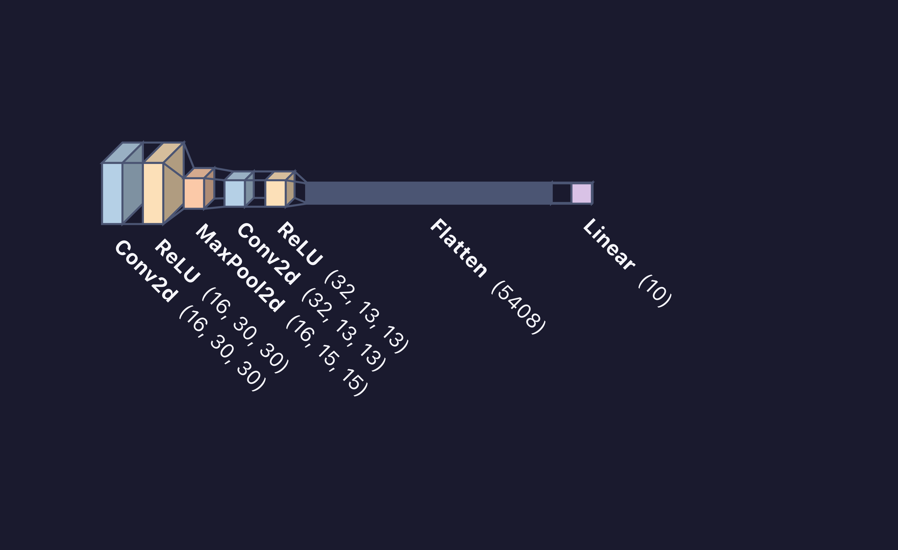
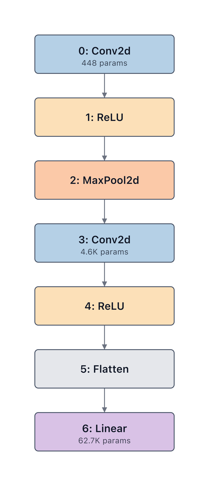
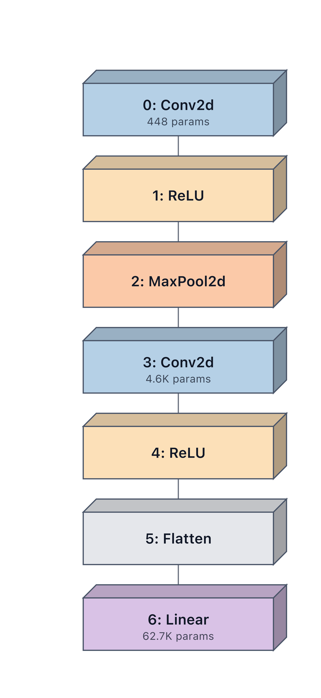
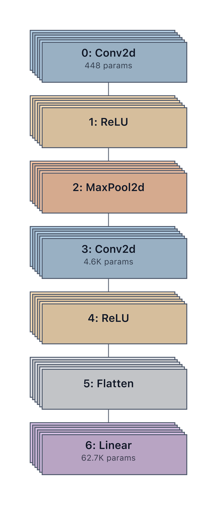
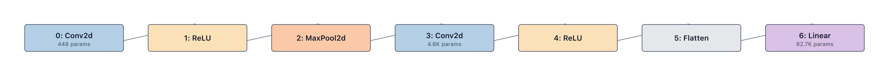

# Styling Guide

Every visual element is resolved through a five-level priority system,
from lowest priority to highest:

1. **Theme defaults** — a `Theme` object provides the background,
   default fill/stroke, edge color, and font.
2. **Layer-type palette** — a dict of `{"Conv2d": "#4a90d9", ...}`
   mapping layer types to fill colors. A `"*"` key acts as a wildcard
   fallback for unmapped types.
3. **Segment groups** — a `Group` claims a set of nodes and can
   override fill/stroke/label color for all of them at once.
4. **Inspector overrides** — set by inspectors when they detect
   something noteworthy (e.g. a quantized layer badge).
5. **`node_styles`** — a `{node_id: NodeStyle(...)}` dict, the highest-
   priority level, giving you per-node control.

## Themes

```python
mv.render(model, theme="dark")
```



Built-in themes: `light`, `dark`, `pastel`, `grayscale`, and
`high_contrast`.

For a custom theme:

```python
from modelvision import Theme

my_theme = Theme(
    name="brand",
    background="#0f172a",
    default_fill="#1e293b",
    font_color="#f8fafc",
    edge_color="#94a3b8",
    layer_palette={"Conv2d": "#38bdf8", "Linear": "#f472b6", "*": "#334155"},
)
mv.render(model, theme=my_theme)
```

## Group Styling

Groups accept either an explicit node list, a glob, or a regex:

```python
from modelvision import Group

mv.render(model, groups=[
    Group(id="stem",   nodes=["conv1", "bn1"], fill="#1e40af"),
    Group(id="stage1", node_pattern="layer1.*", fill="#7c2d12"),
    Group(id="head",   node_pattern_re=r"fc\d*", fill="#065f46"),
])
```

## Node Styling

```python
from modelvision import NodeStyle

mv.render(model, node_styles={
    "features.0": NodeStyle(fill="#c0392b", label="Entry conv", glow=True),
    "classifier.6": NodeStyle(shape="diamond", icon="🎯"),
})
```


## Accessibility

Pass `accessibility_check=True` to emit a warning for every node whose
label contrast fails WCAG AA. Pass `accessibility_check="enforce"` to
have ModelVision automatically bump each font color until AA passes.

## Block styles

Three `style_variant` values control the shape of every node. They work
with any layout and any framework.

### `"flat"` — 2D rounded rectangles (default)

```python
mv.render(model, "diagram.svg", theme="light", palette="pastel",
          layout="vertical")
```



### `"volumetric"` — 3D isometric cuboids

```python
mv.render(model, "diagram.svg", theme="light", palette="pastel",
          layout="vertical", style_variant="volumetric")
```



### `"stacked"` — channel-slice slabs

```python
mv.render(model, "diagram.svg", theme="light", palette="pastel",
          layout="vertical", style_variant="stacked")
```



## Layouts

Five `layout` values are available and compose freely with any `style_variant`.

| Layout | Description |
|---|---|
| `"vertical"` | Top-to-bottom flowchart (default) |
| `"horizontal"` | Left-to-right flowchart |
| `"flow"` | Visualtorch-style isometric ribbon with tapered funnels between blocks |
| `"radial"` | Circular fan layout — useful for wide branching models |
| `"hierarchical"` | Tree layout respecting module nesting depth |

```python
# Horizontal flat layout
mv.render(model, "diagram.svg", theme="light", palette="pastel",
          layout="horizontal")
```

{ .wide }
